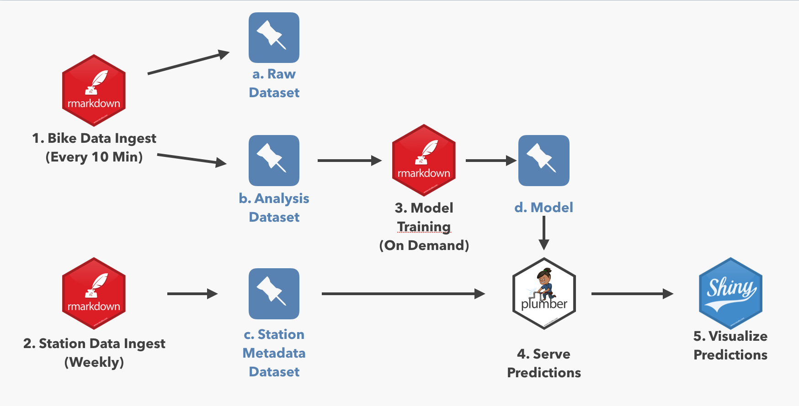

This repository contains an example of using [RStudio
Connect](https://rstudio.com/products/connect/) along with the
[pins](https://github.com/rstudio/pins) package to create an end-to-end
machine learning pipeline.

Who This is For
===============

Both *data scientists* and *R admins* in machine-learning heavy contexts
may find this demo interesting. People who describe *production-izing*
or *deploying* content as pain points may find this useful.

Some particular pain points this could address:

### I am trying to deploy/productionize a machine learning model

People mean MANY different things by “productionize” a machine learning
model. Very often, that just means making the output of a model
available to another process. The most common paths to making model
output accessible to other tools are writing to a database, writing to a
flat file (or pin), or providing real-time predictions with a plumber
API.

This repository contains examples of all three of these patterns. The
model metrics script outputs the test data including predictions to a
database and outputs model performance metrics to a pin. It would be
easy to make either of these the final consumable for another process,
like the client shiny app. The shiny app in this repository uses a
plumber API serving predictions.

Another common problem in deploying the model is figuring out where the
model lives. In this example, the model(s) is(are) pinned to RStudio
Connect, and are consumed by the other assets (test data script and
plumber API) from the pin.

For relatively advanced model deployments, users may be interested in
horseracing different models, A/B testing one model from another, or
monitoring model performance and drift over time. Once finished, the
model performance dashboard will be a tool to compare different models
and also examine model performance over time.

Another piece embedded in the background of deploying/productionizing a
model is making the entire pipeline robust to (for example) someone
accidentally pushing the deploy button when they shouldn’t. A really
good solution to this is programmatic deployment. This entire repository
is deployed from a github repo, using the functionality in RStudio
Connect. One really cool problem this can solve is deploying dev
versions of content, which can easily be accomplished using a
long-running deployed dev branch. There’s an example of this in the Dev
Client App.

Another piece of this is making the underlying R functions more robust,
see the next point for more on that.

### I have a bunch of functions I need to use, but it’s a pain

Most R users know that the correct solution is to put their R functions
into a package if they’ll be reused – or even if they just need to be
well-documented and tested. This repository includes a package of helper
functions that do a variety of tasks.

Many R users aren’t sure how to deploy their package. Their packages
work well locally, but everything breaks when they try to deploy. This
is a great use case for RStudio Package Manager. RStudio Package Manager
makes it easy to create a package that contains the code needed in an
app, push that code up to git, and have it available via
`install.packages` to a deployment environment (like RStudio Connect)
that might need it.

For more details, see the [RStudio Package
Manager](https://rstudio.com/products/package-manager/) page and
<a href="https://environments.rstudio.com" class="uri">https://environments.rstudio.com</a>.

### I have a bunch of CSV files I use in my shiny app

For some workflows, a CSV file really is the best choice for storing
data. However, for many (most?) of those cases, the data would do better
if stored somewhere centrally accessible by multiple people where the
latest version is always available. This is particularly true if that
data is reused across multiple projects or pieces of content.

This project has two data files that are particularly pin-able – the
station metadata file (that maps station IDs to names and locations),
and the data frame of out-of-sample error metrics for each model. Both
are relatively small files, reused by multiple assets, where only the
newest version is needed – perfect candidates for a pin.

There are a few other non-dataset objects that are also perfect for a
pin: the models themselves and the test/training split. These have
similar properties to the datasets – small, reused, and only the newest
is needed – and are serializable by R, making them great choices for a
pin.

Some examples of objects that are likely to be a good fit for a pin:

-   machine learning models
-   plotting data that is updated on a schedule (as opposed to created
    on demand)
-   data splits/training data sets
-   metadata files from some sort of machine-readable ID to
    human-readable details

### I’ve got this CRON job that does some ETL/data processing/creates a bunch of files

Scheduled R Markdown isn’t *always* the best solution here (for example,
robust SQL pipelines in another tool definitely don’t need to be
replaced with scheduled RMarkdown), but if the user is running R code,
scheduled R Markdown is way easier than anything else.

What doesn’t it do
------------------

This repository shows off a really exciting set of capabilities,
combining open-source R and Python with RStudio’s professional products.
There are a few things it doesn’t do (yet) – but that I might add,
depending on interest:

-   Jobs don’t depend on another. I’ve scheduled the jobs so that each
    will complete by the time another starts, but there are tools in R
    (like [drake](https://github.com/ropensci/drake)) that allow you to
    put the entire pipeline into code and make dependencies explicit.
-   Pieces of content must be managed individually – that includes
    uploading, permissions, environment variables, and tagging. It is
    possible to do something more robust via programmatic deployment
    using the RStudio Connect API, but generic git deployment doesn’t
    support deploying all of the content in a git repo at once.

Content in this App
===================

Here’s what the system looks like 

Individual Content
------------------

<table>
<thead>
<tr class="header">
<th style="text-align: left;">Content</th>
<th style="text-align: left;">Content Description</th>
<th style="text-align: left;">Code</th>
<th style="text-align: left;">Pin</th>
<th style="text-align: left;">Refresh Frequency</th>
</tr>
</thead>
<tbody>
<tr class="odd">
<td style="text-align: left;"><a href="https://colorado.rstudio.com/rsc/bike_intake_raw">Raw Data Ingest Script</a></td>
<td style="text-align: left;">Writes data from API calls into <code>bike_raw_data</code> table in postgres.</td>
<td style="text-align: left;"><a href="https://github.com/rstudio/bike_predict//blob/master/ETL/intake_raw/ETL_raw_into_db.Rmd">Code</a></td>
<td style="text-align: left;">NA</td>
<td style="text-align: left;">Every 20 Minutes</td>
</tr>
<tr class="even">
<td style="text-align: left;"><a href="https://colorado.rstudio.com/rsc/bike_clean_raw">Clean Data Script</a></td>
<td style="text-align: left;">Cleans <code>bike_raw_data</code> for modeling, writes into <code>bike_model_data</code>.</td>
<td style="text-align: left;"><a href="https://github.com/rstudio/bike_predict//blob/master/ETL/clean_raw/ETL_clean_raw.Rmd">Code</a></td>
<td style="text-align: left;">NA</td>
<td style="text-align: left;">Daily (4 am)</td>
</tr>
<tr class="odd">
<td style="text-align: left;"><a href="https://colorado.rstudio.com/rsc/bike_station_data_ingest">Clean Station Metadata Script</a></td>
<td style="text-align: left;">Ingests station metadata and saves to a pin (names, lat/long).</td>
<td style="text-align: left;"><a href="https://github.com/rstudio/bike_predict//blob/master/ETL/station_api_to_pin/ETL_station_api_to_pin.Rmd">Code</a></td>
<td style="text-align: left;"><a href="https://colorado.rstudio.com/rsc/bike_station_info">bike_station_info</a></td>
<td style="text-align: left;">Weekly (Sundays)</td>
</tr>
<tr class="even">
<td style="text-align: left;"><a href="https://colorado.rstudio.com/rsc/bike_data_split">Data Split Script</a></td>
<td style="text-align: left;">Creates a training/test split for the data for models to use, saves to a pin.</td>
<td style="text-align: left;"><a href="https://github.com/rstudio/bike_predict//blob/master/ETL/data_split/data_split.Rmd">Code</a></td>
<td style="text-align: left;"><a href="https://colorado.rstudio.com/rsc/bike_model_params">bike_model_params</a></td>
<td style="text-align: left;">Daily (5 am)</td>
</tr>
<tr class="odd">
<td style="text-align: left;"><a href="https://colorado.rstudio.com/rsc/bike_train_rxgb">R XGB Model Train</a></td>
<td style="text-align: left;">Retrains model based on training/test split indicated by Data Split Script, writes into pin.</td>
<td style="text-align: left;"><a href="https://github.com/rstudio/bike_predict//blob/master/Model/build_rxgb/build_rxgb.Rmd">Code</a></td>
<td style="text-align: left;"><a href="https://colorado.rstudio.com/rsc/bike_rxgb">bike_rxgb</a></td>
<td style="text-align: left;">Daily (6 am)</td>
</tr>
<tr class="even">
<td style="text-align: left;"><a href="https://colorado.rstudio.com/rsc/bike_model_metrics_script">Model Metrics Script</a></td>
<td style="text-align: left;">Writes <code>bike_test_data</code> and <code>bike_predictions</code> postgres tables, writes pin of goodness-of-fit metrics.</td>
<td style="text-align: left;"><a href="https://github.com/rstudio/bike_predict//blob/master/Model/model_quality_metrics/model_quality_metrics.Rmd">Code</a></td>
<td style="text-align: left;"><a href="https://colorado.rstudio.com/rsc/bike_err_dat">bike_err_dat</a></td>
<td style="text-align: left;">Daily (8 am)</td>
</tr>
<tr class="odd">
<td style="text-align: left;"><a href="https://colorado.rstudio.com/rsc/bike_model_performance_app">Model Performance App</a></td>
<td style="text-align: left;">Displays model performance metrics.</td>
<td style="text-align: left;"><a href="https://github.com/rstudio/bike_predict//blob/master/App/model_performance/app.R">Code</a></td>
<td style="text-align: left;">NA</td>
<td style="text-align: left;">NA</td>
</tr>
<tr class="even">
<td style="text-align: left;"><a href="https://colorado.rstudio.com/rsc/bike_predict_api">Model API</a></td>
<td style="text-align: left;">Serves model predictions via Plumber API.</td>
<td style="text-align: left;"><a href="https://github.com/rstudio/bike_predict//blob/master/API/plumber.R">Code</a></td>
<td style="text-align: left;">NA</td>
<td style="text-align: left;">NA</td>
</tr>
<tr class="odd">
<td style="text-align: left;"><a href="https://colorado.rstudio.com/rsc/bike_predict_app">Bike Prediction App</a></td>
<td style="text-align: left;">Displays predictions from App.</td>
<td style="text-align: left;"><a href="https://github.com/rstudio/bike_predict//blob/master/App/client_app/app.R">Code</a></td>
<td style="text-align: left;">NA</td>
<td style="text-align: left;">NA</td>
</tr>
<tr class="even">
<td style="text-align: left;"><a href="https://colorado.rstudio.com/rsc/dev_bike_predict_app">Dev Bike Prediction App</a></td>
<td style="text-align: left;">Dev version of Bike Prediction App</td>
<td style="text-align: left;"><a href="https://github.com/rstudio/bike_predict//blob/dev/App/client_app/app.R">Code</a></td>
<td style="text-align: left;">NA</td>
<td style="text-align: left;">NA</td>
</tr>
<tr class="odd">
<td style="text-align: left;"><a href="https://demo.rstudiopm.com/client/#/repos/8/packages/bikeHelpR">bikeHelpR Package</a></td>
<td style="text-align: left;">An R package of helper functions, built in internal repo on demo.rstudiopm.com.</td>
<td style="text-align: left;"><a href="https://github.com/rstudio/bike_predict//blob/master/pkg">Code</a></td>
<td style="text-align: left;">NA</td>
<td style="text-align: left;">Tags</td>
</tr>
</tbody>
</table>

Last updated 2020-01-17.
