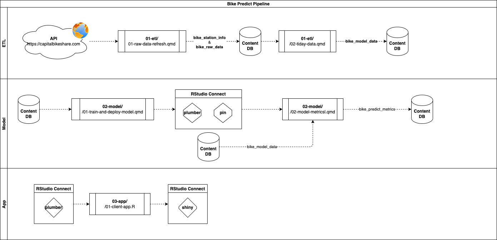

## Pipeline

The diagram below describes the bike predict data flow.

## Individual Content

+-------------------------------------------+------------------------------------------------------------------------------------------------------------------------------------------------------------------------------------------------------------------------+----------------------------------------------------------------------------------------------------+------------------------------------------------------------------------------------------------+
| Content                                   | Description                                                                                                                                                                                                            | Code                                                                                               | Content Deployed to Connect                                                                    |
+===========================================+========================================================================================================================================================================================================================+====================================================================================================+================================================================================================+
| **ETL** Step 01 - Raw Data Refresh        | Get the latest station status data from the <https://capitalbikeshare.com> API. The data is written to *Content DB* in table *bike_raw*\_data and *bike_station_info*.                                                 | [content/01-etl/01-raw-data-refresh.qmd](./content/01-etl/01-raw-data-refresh.qmd)                 | -   [Quarto document](https://colorado.rstudio.com/rsc/bike-predict-r-raw-data-refresh/)       |
+-------------------------------------------+------------------------------------------------------------------------------------------------------------------------------------------------------------------------------------------------------------------------+----------------------------------------------------------------------------------------------------+------------------------------------------------------------------------------------------------+
| **ETL** Step 2 - Tidy data                | From *Content DB* get two tables: (1) *bike_raw*\_data and (2) *bike_station_info*. The two data sets are tidied and then combined. The resulting tidy data set is written to *Content DB* in table *bike_model_data*. | [content/01-etl/02-tidy-data.qmd](./content/01-etl/02-tidy-data.qmd)                               | -   [Quarto document](https://colorado.rstudio.com/rsc/bike-predict-r-tidy-data/)              |
+-------------------------------------------+------------------------------------------------------------------------------------------------------------------------------------------------------------------------------------------------------------------------+----------------------------------------------------------------------------------------------------+------------------------------------------------------------------------------------------------+
| **Model** Step 1 - Train and Deploy Model | From *Content DB* get the *bike_model_data* table and then train a model. The model is saved to Connect as a pin, and then deployed to Connect as a plumber API using vetiver.                                         | [content/02-model/01-train-and-deploy-model.qmd](./content/02-model/01-train-and-deploy-model.qmd) | -   [Quarto document](https://colorado.rstudio.com/rsc/bike-predict-r-train-and-deploy-model/) |
|                                           |                                                                                                                                                                                                                        |                                                                                                    |                                                                                                |
|                                           |                                                                                                                                                                                                                        |                                                                                                    | -   [Pin](https://colorado.rstudio.com/rsc/bike-predict-r-station-info-data-pin/)              |
|                                           |                                                                                                                                                                                                                        |                                                                                                    |                                                                                                |
|                                           |                                                                                                                                                                                                                        |                                                                                                    | -   [API](https://colorado.rstudio.com/rsc/bike-predict-r-api/)                                |
+-------------------------------------------+------------------------------------------------------------------------------------------------------------------------------------------------------------------------------------------------------------------------+----------------------------------------------------------------------------------------------------+------------------------------------------------------------------------------------------------+
| **Model** Step 2 - Model Metrics          | Use the API endpoint to test the model performance. Model performance metrics are written to table *bike_predict_metrics* in *Content DB*.                                                                             | [content/02-model/02-model-metrics.qmd](./content/02-model/02-model-metrics.qmd)                   | -   [Quarto document](https://colorado.rstudio.com/rsc/bike-predict-r-model-metrics/)          |
+-------------------------------------------+------------------------------------------------------------------------------------------------------------------------------------------------------------------------------------------------------------------------+----------------------------------------------------------------------------------------------------+------------------------------------------------------------------------------------------------+
| **App** Step 1- Client App                | Use the API endpoint to interactively server predictions to a shiny app.                                                                                                                                               | [content/03-app/01-client-app.R](content/03-app/01-client-app.R)                                   | -   [Shiny app](https://colorado.rstudio.com/rsc/bike-predict-r-client-app/)                   |
+-------------------------------------------+------------------------------------------------------------------------------------------------------------------------------------------------------------------------------------------------------------------------+----------------------------------------------------------------------------------------------------+------------------------------------------------------------------------------------------------+
