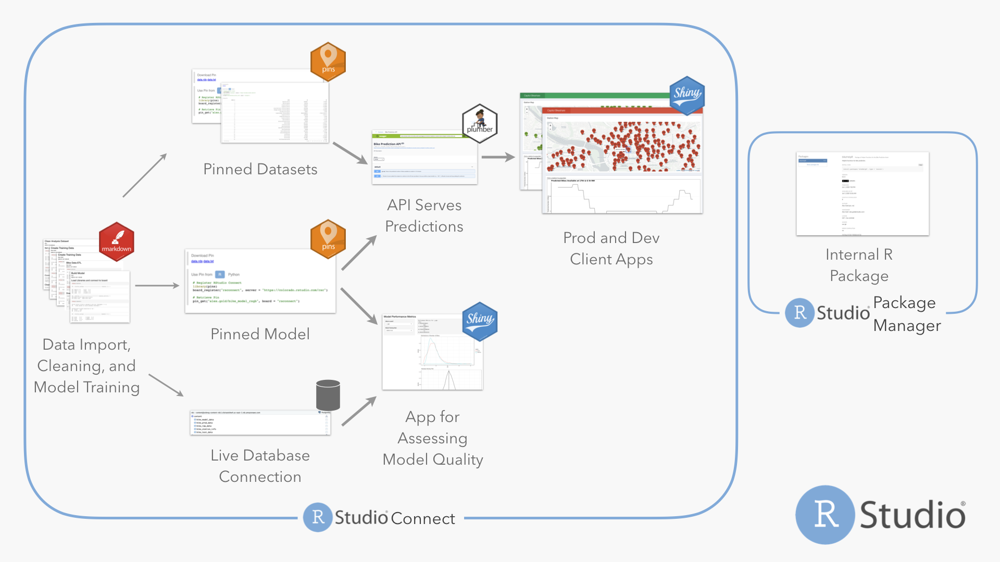

```{css, echo=FALSE}
.main-container {
    width: 100%;
    max-width: unset;
}

.main {
    max-width: 940px;
    margin-left: auto;
    margin-right: auto;
}

.jumbotron {
  color: white;
  background-image: url("https://source.unsplash.com/zbUH21c9ARk/1920x1080");
  background-position: center;
  background-repeat: no-repeat;
  background-size: cover;
  height: 50vh;
  /* filter: brightness(75%) */
}

#header {
  display: none
}
```

<div class="jumbotron jumbotron-fluid">
<div class="container">
<h1 class="display-3" color="#f0f0f0">Bike Share</h1>
<p class="lead">End-to-End Data Science with RStudio Connect</p>
</div>
</div>


```{r setup, include=FALSE}
knitr::opts_chunk$set(echo = FALSE, warning = FALSE, message = FALSE)
library(connectwidgets)
library(dplyr)
library(stringr)
library(metathis)

client <- connect()
all_content <- client %>% content()
bikeshare <- all_content %>% by_tags(tagnames = "Pins Demo: Bikes")
```

```{r}
meta() %>% 
  meta_description(description = "ETL, model serving, and app deployment--powered by RStudio Connect.") %>% 
  meta_viewport() %>% 
  meta_social(
    title = "End-to-end data science with RStudio Connect",
    url = paste0(Sys.getenv("CONNECT_SERVER"), "/bike-share"),
    image = paste0(Sys.getenv("CONNECT_SERVER"), "/bike-share", "/arrows.png"),
    image_alt = "Diagram of flow from scheduled jobs to apps",
    twitter_card_type = "summary",
    og_type = "article"
  )
```


<div class="main">

This project illustrates using RStudio Connect to deploy a data science project featuring:

### Scheduled jobs

- Fetching and cleaning data from a continuously updating web source
- Pushing cleaned data to a relational database
- Creating intermediate datasets for subsequent use

### Pins

- Serving intermediate datasets and model objects for use in apps, APIs, and other jobs

### APIs

- Serving model predictions via HTTP requests

### Development and Production Apps
  
- Exposing model predictions to end-users through Shiny and Dash apps
- Using git-backed deployment to keep a stable version of the application available from the main branch while doing development work on another branch

### Private Packages

- Encapsulate re-usable logic in an R package, and distribute with Package Manager



Explore the deployed items below:

## Scheduled Jobs {.tabset}

### ETL

```{r}
bikeshare %>% 
  filter(app_mode == "rmd-static", str_detect(title, "ETL")) %>% 
  rsc_grid()
```

### Modeling

```{r}
bikeshare %>% 
  filter(app_mode == "rmd-static", str_detect(title, "Train|Scoring")) %>% 
  rsc_grid()
```

### Email Alerts

```{r}
bikeshare %>% 
  filter(app_mode == "rmd-static", str_detect(title, "Email")) %>% 
  rsc_grid()
```

## Pins

```{r}
bikeshare %>% 
  filter(app_mode == "static", content_category == "pin") %>% 
  rsc_table()
```

## APIs

```{r}
bikeshare %>% 
  filter(app_mode == "api") %>% 
  rsc_card()
```

## Apps

```{r}
bikeshare %>%
  filter(app_mode %in% c("shiny", "python-dash")) %>% 
  rsc_card()
```

</div>
